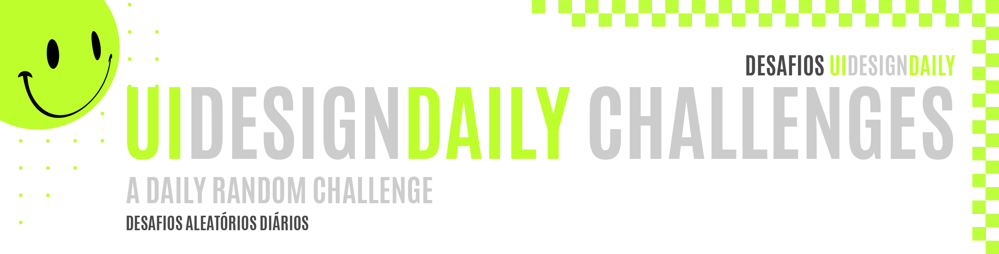
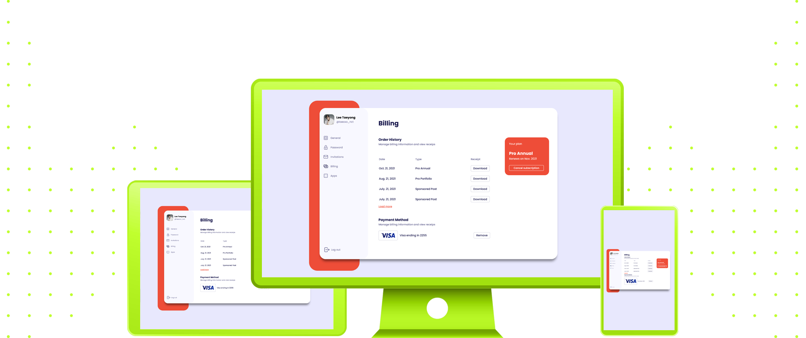

 
 

|                                                          |
| :------------------------------------------------------: |
|  |
|             **Challenge #01:** Billing Page              |
| **Original Project:** [🌐](https://uidesigndaily.com/posts/figma-billing-page-payment-day-1585) / **My Code:** [📄](https://github.com/malunaridev/UI-Design-Daily-01-to-10/tree/master/1-billing-page) / **Live Preview:** [🌐](https://udd-1-billing-page.netlify.app/)

 
 

 

The first challenge from UI Design Daily was a billing page! At first, I loved the color pallete and the design in general, and I was really hyped to start the challenges. I hope the first one hypes me all the way around!

##### O primeiro desafio do UI Design Daily foi um componente de página de pagamentos! Eu adorei a paleta de cores e o design como um todo, e eu fiquei muito animada para começar os desafios. Eu espero que o primeiro me mantenha animada durante todo o caminho!

 
 
 

 

- HTML
- CSS
- [Font Awesome](https://fontawesome.com/)

 
 
 

 

| Validator                                                                        |                     Passed                     |
| -------------------------------------------------------------------------------- | :--------------------------------------------: |
| [Markup Validation Service](https://validator.w3.org/) - <em>w3.org</em>         |  |
| [CSS Validation Service](https://jigsaw.w3.org/css-validator/) - <em>w3.org</em> |  |

 
 
 

 

I had some trouble with positioning the elements, as always. I keep having this problems because of flexbox, and I still need to improve it a lot. I will be specially working on this matter in the next few days.

##### Eu tive um pouco de dificuldade ao posicionar os elementos, como sempre. Eu continuo tendo esses problemas devido ao flexbox, e eu ainda preciso melhorar isso. Eu vou trabalhar especialmente nessa questão nos próximos dias.

 
 
 

