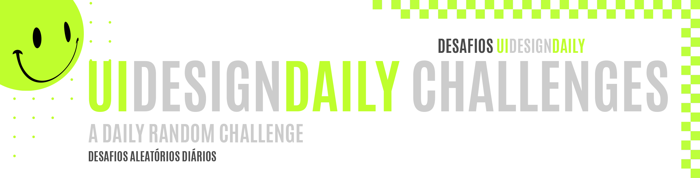
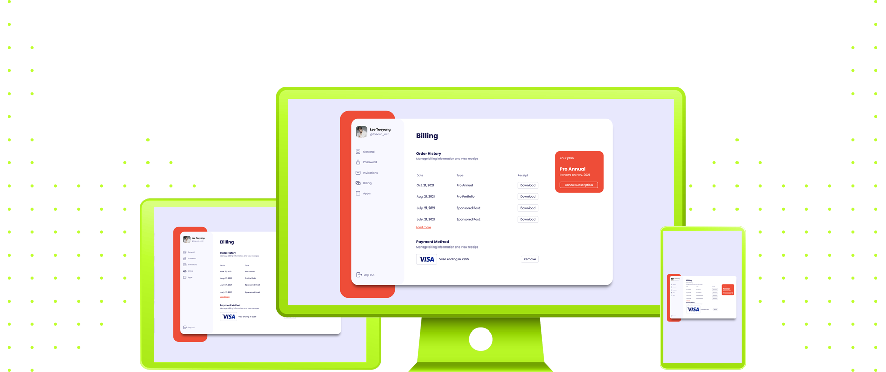

 
 

  

UI Design Daily is a project I have found on Behance first, and then I realized they had an special website to keep tracking the designs. Apparently, it is a challenge for designing UI and UX screens, mostly components. I think it is a good way to keep coding everyday, so I have decided to code all them! It's a little bit scary because it has around 1700 challenges! But a great quantity of things to do always keep my excitment high!

##### O UI Design Daily é um projeto que eu encontrei primeiro no Behance, e depois percebi que eles tinham um site próprio para hospedar os designs. Aparentemente, este é um desafio proposto para designers de UI/UX, e na maior parte são componentes. Eu acredito que isso seja uma boa forma de me manter codando todos os dias, então eu decidi codar todos! É um pouco assustador, porque são cerca de 1700 desafios! Mas uma grande quantidade de coisas para fazer sempre mantém a minha animação!

 
 
 
 

 

|         |             |    
| :-------------:|:-------------:|
|  |   |
| **Challenge #01:** Billing Page   |  |
| **Code:** [📄](https://github.com/malunaridev/UI-Design-Daily-01-to-10/tree/master/1-billing-page) \| **Live Preview:** [🌐](https://udd-1-billing-page.netlify.app/) | 

 
 
 

